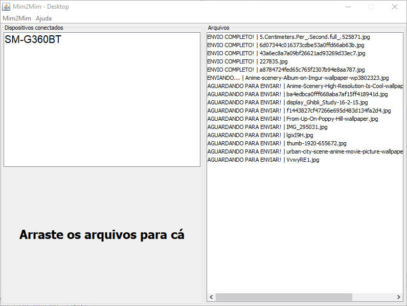

#Mim2Mim (m2m)

Este projeto se encontra em atualização

### Descrição

Esta aplicação funciona em par com [m2m-Mobile](https://github.com/henrique-dev/m2m-Mobile). Essa versão é a desktop e
tem como objetivo a transferência de arquivos de um computador para um smartphone através de conexão Wireless.

### Funcionamento

Esta é a janela única da aplicação:

